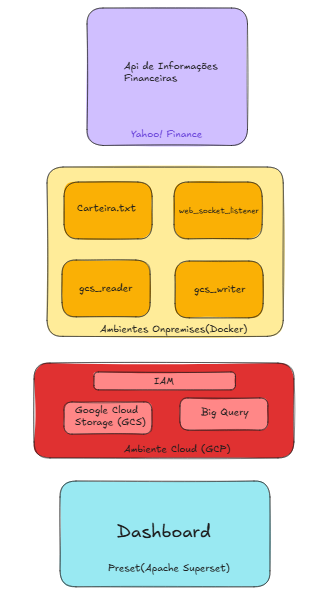
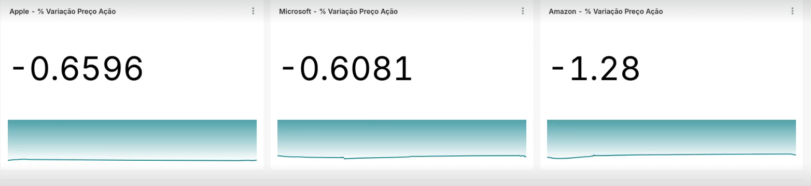

# 📊 Streaming de Dados Financeiros com Spark, Kafka e Google Cloud Platform

## 🚀 Visão Geral

Este projeto simula uma arquitetura moderna de **engenharia de dados em tempo real**, utilizando dados financeiros da API do Yahoo Finance.

O pipeline foi projetado para representar um ambiente real de empresa, separando processamento em **camada local (on-premises via Docker)** e **camada cloud (Google Cloud Platform)**, com foco em ingestão contínua, processamento distribuído e análise de dados.

Link para Download Jar: https://repo1.maven.org/maven2/com/google/cloud/bigdataoss/gcs-connector/hadoop3-2.2.5/gcs-connector-hadoop3-2.2.5-shaded.jar

---

## 🧠 Objetivo do Projeto

Simular um sistema de **data streaming financeiro** capaz de:

- Capturar cotações em tempo real de ativos financeiros
- Processar dados com Spark Structured Streaming
- Armazenar dados em Data Lake (GCS)
- Disponibilizar dados para análise no BigQuery
- Visualizar insights em dashboards no Apache Superset

---
<h2 align="center">🏗️ Arquitetura do Projeto</h2>

<p align="center">
  
</p>

---

<h2 align="center">📊 Dashboard Financeiro</h2>

<p align="center">
  
</p>

## 🔄 Arquitetura do Pipeline

```text
Yahoo Finance API
        ↓
web_socket_listener (ingestão de dados)
        ↓
Kafka (infraestrutura preparada para streaming)
        ↓
Apache Spark Structured Streaming
        ↓
Google Cloud Storage (Bronze → Silver)
        ↓
BigQuery (camada analítica)
        ↓
Apache Superset (Dashboards)
```

📂 Estrutura do Projeto

```
projeto_streaming_financeiro/
│
├── app/
│   ├── web_socket_listener.py     # Coleta dados da API Yahoo Finance
│   ├── gcs_writer.py              # Processamento Spark → GCS
│   ├── gcs_reader.py              # Leitura e validação dos dados
│   ├── carteira.txt               # Lista de ativos monitorados
│   └── requirements.txt
│
├── jars/
│   └── gcs-connector.jar          # Conector Spark ↔ GCS
│
├── docker-compose.yaml            # Infraestrutura local (Kafka + Spark)
├── Dockerfile                     # Ambiente Spark
└── README.md
```

⚙️ Como Executar o Projeto
1. Subir infraestrutura local
```
docker-compose up -d
```

2. Iniciar coleta de dados
```
docker exec -it spark-gcs python app/web_socket_listener.py
```

3. Executar pipeline Spark
```
docker exec -it spark-gcs spark-submit \
  --jars jars/gcs-connector-hadoop3-2.2.5-shaded.jar \
  app/gcs_writer.py
```
## 📦 Tecnologias Utilizadas

- **Apache Kafka**
- **Apache Spark Structured Streaming**
- **Google Cloud Storage (GCS)**
- **BigQuery (opcional)**
- **IAM (GCP)**
- **Docker & Docker Compose**
- **Python 3.10+**
- **Yahoo Finance API (via yfinance)**
- **Apache Superset**


## 📊 Casos de Uso
- **Monitoramento de ativos financeiros em tempo real**
- **Análise de variação de preços**
- **Criação de dashboards financeiros dinâmicos**
- **Simulação de arquitetura de streaming de mercado**

## 🚀 Possíveis Evoluções
- **Integração completa do Kafka no pipeline de streaming**
- **Implementação de camada Gold com Spark SQL**
- **Orquestração com Apache Airflow**
- **Data Quality com Great Expectations**
- **Deploy em GCP (Dataproc / Dataflow)**
- **CI/CD com GitHub Actions**

## 🎯 Destaques do Projeto

- **✔ Arquitetura de dados moderna (streaming + lakehouse)**
- **✔ Uso de Spark Structured Streaming**
- **✔ Integração com Google Cloud (GCS + BigQuery)**
- **✔ Estrutura profissional com separação por camadas**
- **✔ Simulação de ambiente real de empresa**

## 📄 Licença

**Projeto educacional com fins de portfólio profissional.**

📬 Contato
- **[LinkedIn](https://www.linkedin.com/in/thiago-cbferreira/)**  
- **[Github]((https://github.com/ThiagoCBF))**
